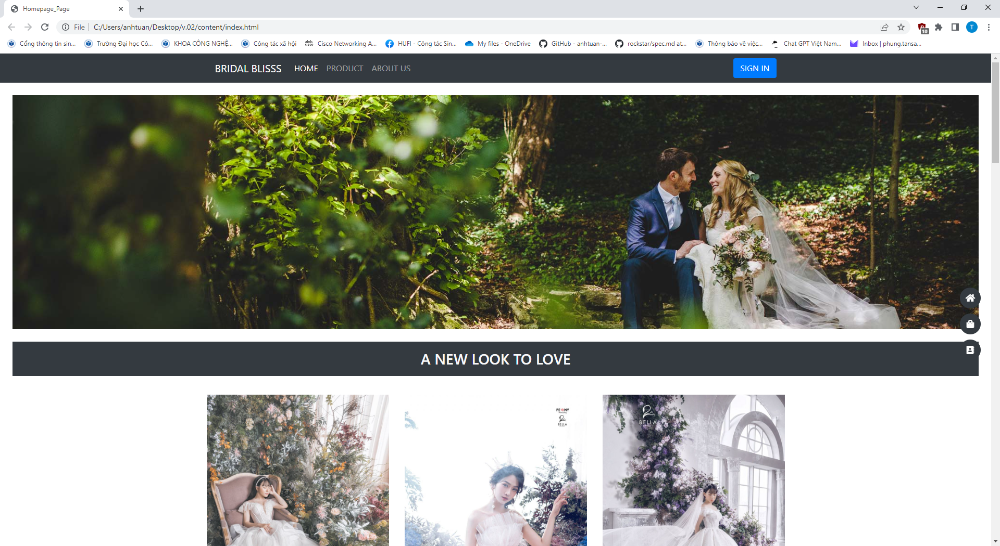
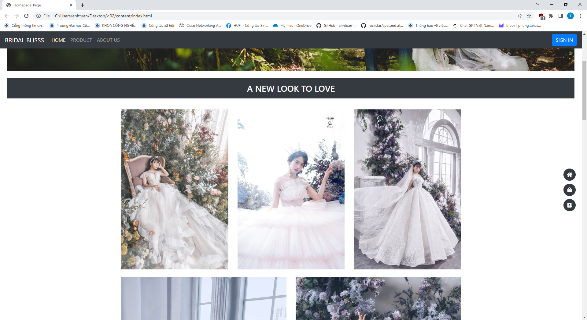
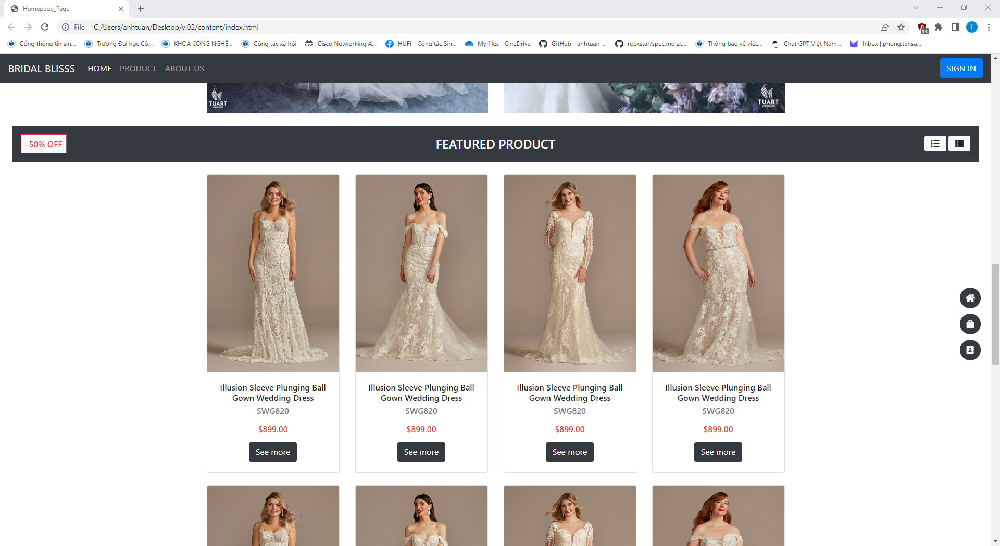
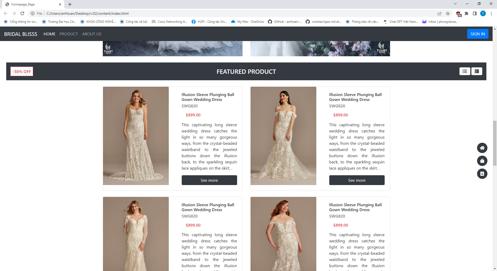
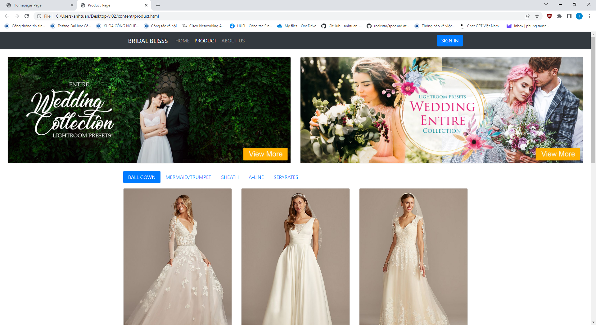
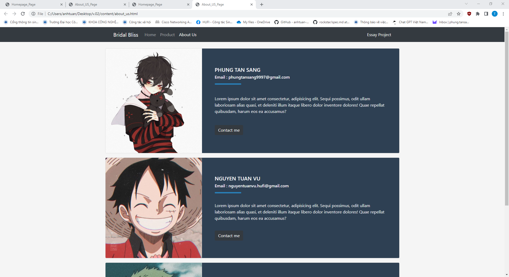
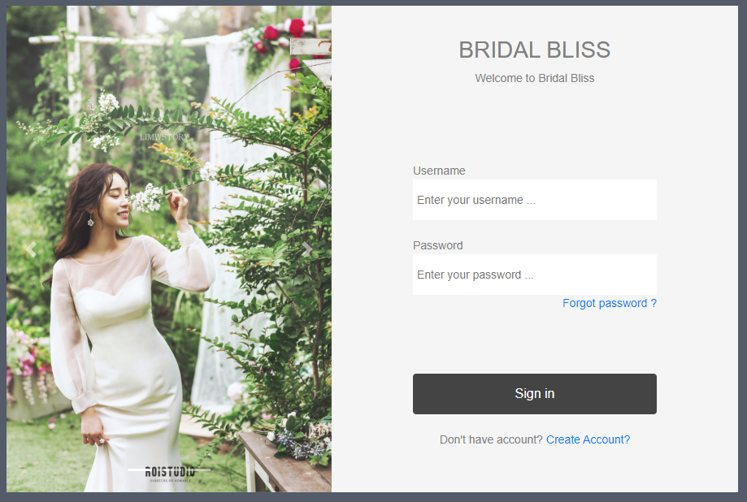

# BÀI TẬP TIỂU LUẬN : Xây dựng một trang web thời trang (bài làm sử dụng thời trang áo cưới)

### Lí do thực hiện :
Nhóm chọn thời trang áo cưới là vì :
- Từng tham khảo các trang bán hàng điện tử và thấy thích hợp chọn một trang web bán hàng điện tử.
- Lĩnh vực thời trang sẽ có nhiều hình ảnh minh họa mang tính nghệ thuật cao.

### Tổng quan nội dung trang web :
- Thiết kế dưới dạng một trang thông tin bán hàng, bao gồm :
	- Trang chủ (index.html) : trang chủ của trang web.
		- Thanh điều hướng với chức năng bố trí tĩnh trên trang (sử dụng javascript có sẵn trong thư viện bootstrap).
		- Phần trình chiếu ảnh động (sử dụng javascript).
		- Các nội dung về sản phẩm (sử dụng hiệu ứng hover khi di chuyển chuột vào đối tượng và nút lệnh hiển thị nội dung khác nhau theo dạng danh sách).
		- Phần chân trang thể hiện các thông tin liên kết.

	- Trang sản phẩm (product.html) : trang thể hiển các sản phẩm của của hàng.
	- Trang thông tin sản phẩm (item.html) : trang thể hiện thông tin của sản phẩm.
	- Trang về thông tin nhóm (about_us.html) : trang hiển hiện các thông tin mẫu về nhóm thực hiện.

### Một số hình ảnh về trang web :

